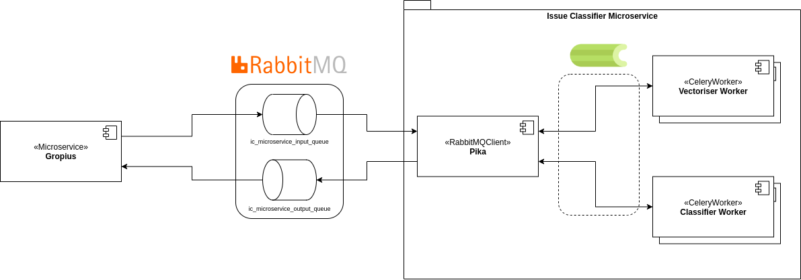

# Issue Classifier Microservice

This is the complete Issue Classifier Microservice. RabbitMQ with AMQP is used as a message broker between the outside world and the microservice itself as well as intra-microservice passing of messages.

For the processing of tasks, dedicated Celery workers are used. In short, Celery is a system for implementing distributed task queue. Celery workers, which are essentially separate processes, receive *tasks*, basically computation tasks, which for this project consist of vectorisation as well as classification of the vectorised data.

Although the initial decision for Celery was multitude, including, but not limited to, asynchronous processing of data as well as monitoring capabilities using [Flower](https://flower.readthedocs.io/en/latest/), there seems to be a standing issue regarding directly sending results back into the queue instead of sending them back to the consuming pika client. Several possible workarounds have still yet to be implemented, but since the microservice is a proof-of-concept, we do not believe it is of standing issue.

**IMPORTANT NOTE**

**As of writing this Readme, the code/microservice is NOT (fully) production-ready. There are some issues that have yet to be addressed, such as the usage of pickle as a result serializer, which is, according to the [Celery](https://docs.celeryproject.org/en/stable/userguide/security.html#serializers) as well as the [kombu](https://docs.celeryproject.org/projects/kombu/en/stable/userguide/serialization.html) documentations, insecure, since "carefully crafted payloads can do almost anything a regular Python program can do".**

**Furthermore, asynchronous task processing should be resolved, but due to [an unresolved bug in Celery](https://github.com/celery/celery/issues/3848), workers cannot send results to a manually-set queue. Workarounds are not impossible, but have proven in light of time constraints unnecessarily cumbersome.**

### Architecture



### The following libraries/toolkits are utilised:
- [RabbitMQ w/ AMQP](https://www.rabbitmq.com/): Acts as an inter- and intra-microservice message broker 
- [pika](https://pika.readthedocs.io/en/stable/modules/index.html): Python RabbitMQ client used to let the microservice communicate with the running RabbitMQ instance
- [Celery](https://docs.celeryproject.org/): The distributed task queue system. Can also be regarded as an extensive wrapper over RabbitMQ.
- [Redis](https://redis.io/): An in-memory key-value database. This is used to save the results of tasks executed by Celery, so that they can be retrieved later as soon as task processing is finished (not to be confused with returning classification results back to RabbitMQ).
- [Flower](https://flower.readthedocs.io/en/latest/): Celery monitoring tool used to check the status of workers and executed [Celery tasks](https://docs.celeryproject.org/en/stable/userguide/tasks.html).
- [Poetry](https://python-poetry.org/): Python package and dependency management system.
- [Docker](docker.com): Used to containerise the microservice as a whole.
- [Docker Compose](https://docs.docker.com/compose/): Used to manage multi-container applications such as this microservice.
---
## Understanding what `docker-compose up --build` does
In short, it performs the following steps:
1. Creates images for running them as containers
   - For RabbitMQ, Redis, and flower, it pulls from the [Docker hub](https://hub.docker.com/)
   - for the microservice, three containers are created, all dependent on the one and same image:
     - `ic_microservice`: The gateway between the RabbitMQ instance and the vectoriser and classifier services.
     - `vectoriser_worker`: The worker responsible for creating feature vectors of the input issue bodies before sending them on to the classifier worker.
     - `classifier_worker`: The worker responsible for classifying the issues based on their feature vectors (produced from the vectoriser worker).
   - If images already exist and the microservice code remains the same, you can execute `docker-compose up` to skip the building process. Otherwise note that changing the code and skipping rebuild will lead to using the older code instead.
2. Sets some environment variables for the classification service. These can be changed before running `docker-compose up (--build)`.
3. To turn off the microservice along with RabbitMQ, Redis, and flower, execute (in another terminal but within the same directory as the `docker-compose.yaml` file) `docker-compose down`. This will stop the containers.
---
## Descriptions of files of interest:
- `Dockerfile`: The file used by Docker to create the image for the microservice.
- `poetry.lock`: Contains resolved versions of dependencies to produce deterministic builds. This avoids cases where, for example, a newer version of some dependency breaks the functionality of libraries that depend on it.
- `pyproject.toml`: Used to manage information about the project, such as general information about the Python project as well as its the Python (development) dependencies.
- `.dockerignore`: Contains files that will be ignored by Docker when building the microservice image.
- `microservice/main.py`: Represents the pika client used by the microservice to receive issues for classification as well as returning their classification results.
- `microservice/celery_app.py`: Represents the tasks that can be performed by Celery. This takes the form of two functions, one for vectorising using the vectoriser provided by `microservice/vectoriser/main.py`, and the other for classifying using the classifier provided by `microservice/classifier/main.py`.
- `microservice/vectoriser/main.py`: Contains the vectorisation function which uses the provided `vectorizer.vz` for creating the feature vector of the input issues. Returns the results to the pika client in `ic_microservice`.
- `microservice/classifier/main.py`: Contains the classification function which uses the result feature vectors from the vectoriser to classify the issues. Returns the results to the pika client in `ic_microservice`.
---
## Usage instructions
Before starting, it's recommended, but not required, to install the following Visual Studio Code [Docker extension](https://www.google.com/search?q=docker+extension+vscode&oq=docker+extension+vscode&aqs=chrome.0.0i457j0i22i30l7.4185j0j1&sourceid=chrome&ie=UTF-8). It has proven quite useful to us in getting a quick glance of the health of the (running) containers as well as downloaded images.

### To start up the microservice:
Run `docker-compose up --build` in the folder containing the `docker-compose.yaml`, which is `./microservice`.

Under `localhost:15672` and `localhost:5555`, you can obtain an overview of the running RabbitMQ and Flower containers, repectively.

### To test the microservice:
For testing, Python 3.8 is recommended. Older versions have NOT been tested with, so your mileage with older versions may vary.

Run `python test_issue_producer.py "Classification.Classify" '[{"id": 1, "body": "Hello"},{"id": 2, "body": "World"}, {"id": 3, "body": "foo"}]'` in the sub-folder with the name `microservice` in a separate terminal.

- This will send an issue in the form of JSON containing the following payload:
```json
[
{ "id": 1, "body": "Hello" },
{ "id": 2, "body": "World" },
{ "id": 3, "body": "foo" }
]
```

- The payload can be changed if so desired, however it MUST consist of a list of JSON objects, where each object MUST contain an attribute named `body`. Its value MUST be a string.

- The `id` field is currently ignored, but demonstrates a possibilty to identify classifications with the id as well. However, this has not been implemented as of yet.

The returned value to RabbitMQ looks like this:
```json
["bug", "bug", "bug"]
```
- The returned value is ALWAYS a list. Each element of the list can be either a single string in the case of a single label such as `bug`, or it can be a list of strings, where each string represents a label, for example `["bug", "doku"]`.